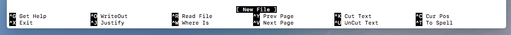
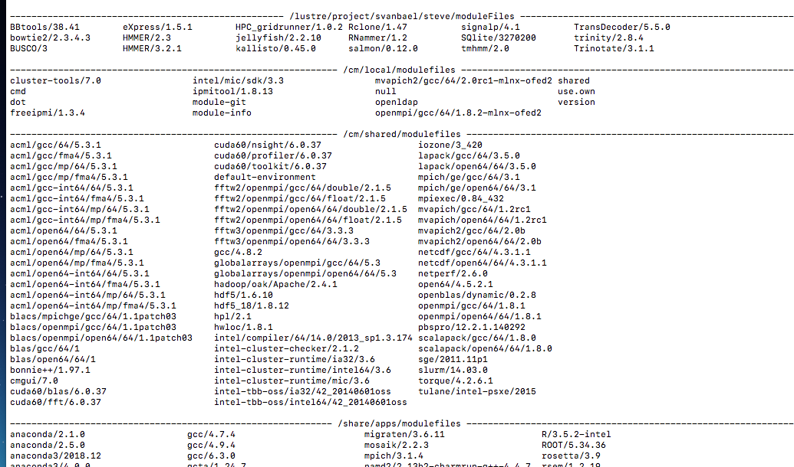

## How to make a program module on Cypress

by Steve Formel
last updated May 31, 2019

##### Description

When you install software locally on Cypress, the Tulane supercomputer, it is a good idea (and sometimes necessary) to create a module, so that when the software is loaded the right elements are added to your environment to kep the software functioning correctly.  [Cypress has a wiki page on this](https://wiki.hpc.tulane.edu/trac/wiki/cypress/ModuleCommand), and this is another [web page that explains more about the language behind modules](http://modules.sourceforge.net/man/modulefile.html).

In short, you're creating a file that tells Cypress where to look when you ask it to run commands from this program.

### Steps

1. Make modulerc file so Cypress knows where to find your module files
2. Make folder for module files
3. Make module file

### Previous Steps

This assumes that you have correctly downloaded and unpacked/compiled the software you're interested in.  Most often the folder in the software you're trying to direct Cypress to find is called bin or src.  Regardless there is usually one folder that contains the commands necessary to run the program.

#### Step1: Make modulerc file

Use an editor to make a file named "modulerc" in your home directory.  

	nano $HOME/.modulerc
	
In this case:

1. nano is the editor (vim is another popular choice)
2. $HOME is the bash variable to call the folder "/home/yourusername"
3. The dot in front of modulerc means it is a hidden file 
4. Don't get freaked out by the fact that modulerc has no extension (e.g. .txt or .csv), it is still a real file.

	

Once you have opened this file in the nano editor add this text (do not add any spaces):

	#%Module
	module use /home/yourusername/modulefiles

To save and exit press:

	"control key" + "x key"

Follow any prompts to save it, otherwise you will lose your work.
	
___

*Note: If you're not familiar with nano, at the bottom you will see:*

*All the actions highlighted in black begin with the ^ sign.  This means press the control key in combination with the following letter.*
	
___

Make the computer aware of the modulerc file by "sourcing" it.

	source $HOME/.modulerc

#### Step 2: Make folder for module files

Now we're going to create the folder to hold our module files.  This is the folder that we told the computer to look for in our modulerc file.

	mkdir $HOME/yourusername/modulefiles
	
#### Step 3: Make module file

A sensible standard when making your module file is to name it the version number of the program, in a folder with the program name.

So for example, if you type:

	module avail
	
You'll notice that all the modules set up by your friendly neighborhood Cypress admins, are named: "software name/version number" (e.g. anaconda/2.1.0)

##### A. Make folder for module file

As you do this keep in mind that you will need to type exactly what you name it every time you load the program.  So respect your future self by being sensible with capital letters, etc.

	mkdir $HOME/yourusername/modulefiles/softwarename
	
##### B. Make module file in softwarename folder

In this example we name the module file after the software version, "1.2", but you can name the module file whatever you want.

	nano $HOME/yourusername/modulefiles/softwarename/1.2

Now that you have made this file, you need to add the information the computer needs to load the program correctly.

	#%Module1.0 -*- tcl -*-
	##
	## modulefile
	##

	module-whatis    description of program
	prepend-path     PATH /path/to/software/bin

	#This bit allows Cypress admins to track module usage and manage shared installations accordingly.
	
	set curMod [module-info name]
	if { [ module-info mode load ] } {
    	system "/bin/logger -p local0.info 'module_load: $curMod.'"
	}

Like before, you should save and exit nano.  To see that it worked, type:

	module avail
	
At the top of the list your module should be listed in a separate group from the other modules on cypress.  Mine looks like this:

*Note that the path listed at the top is where my module files are.  It's not where we're installing it in this tutorial because I was a foolish noob when I first started installing software.  Someday I'll change it to what I recommend here.*

##### C. Run your software

In theory, if you have done it correctly, you can now load your software by typing:

	module load softwarename/1.2
	
And check that it is loaded:

	module list
	
If you don't see it, there could be something you mistyped in your modulerc, or module file.  Send me an email if you're having trouble!

### Real world example - Trinity RNA assembler

Sometimes software is more complex and depends on other software and/or requires you to define environmental variables.  Here is an example of how you add that information to your module file. 

	#%Module1.0 -*- tcl -*-
	##
	## modulefile
	##

	module-whatis    assembles transcript sequences from Illumina RNA-Seq data
	prepend-path     PATH /usr/lib/jvm/jre-1.8.0-openjdk.x86_64/bin
	setenv           JAVA_HOME /usr/lib/jvm/java-1.8.0-openjdk.x86_64/jre
	setenv           TRINITY_HOME /lustre/project/svanbael/steve/software/Trinity/trinityrnaseq-Trinity-v2.8.4
	setenv           TRINITY_UTIL /lustre/project/svanbael/steve/software/Trinity/trinityrnaseq-Trinity-v2.8.4/util
	module           load samtools/1.5 bowtie2/2.3.4.3 R/3.5.2-intel jellyfish/2.2.10 salmon/0.12.0 HPC_gridrunner/1.0.2 anaconda3/5.1.0 rsem/1.2.31 $
	prepend-path     PATH /lustre/project/svanbael/steve/software/Trinity/trinityrnaseq-Trinity-v2.8.4
	prepend-path     PATH /lustre/project/svanbael/steve/software/Trinity/trinityrnaseq-Trinity-v2.8.4/util
	prepend-path     PATH /lustre/project/svanbael/steve/software/Trinity/trinityrnaseq-Trinity-v2.8.4/trinity-plugins/COLLECTL/util
	
##### Explanation of extra parts

If you're feeling Encylopedia Brown-ish [see this page to learn more about the module file "Tool Command" language](http://modules.sourceforge.net/man/modulefile.html).

###### set_env

You'll notice I add "set_env" for a few environmental variables (JAVA_HOME, TRINITY_HOME, etc.)  You'll only know if you need to set these though reading about the software installation.  Essentially you're telling the computer when it sees the variable:

	$TRINITY_UTIL
	
To understand it as:

	/lustre/project/svanbael/steve/software/Trinity/trinityrnaseq-Trinity-v2.8.4/util

###### module

This is a space-separated (as opposed to tabs or commas) list of the other modules on which trinity depends.

## Plea for feedback

I wrote this to try to be helpful.  If there is something wrong in here, or it can be made more clear, please let me know via Github.  There are many things that might make you feel like quitting grad school but troubles with local installation of software shouldn't be one of them.
